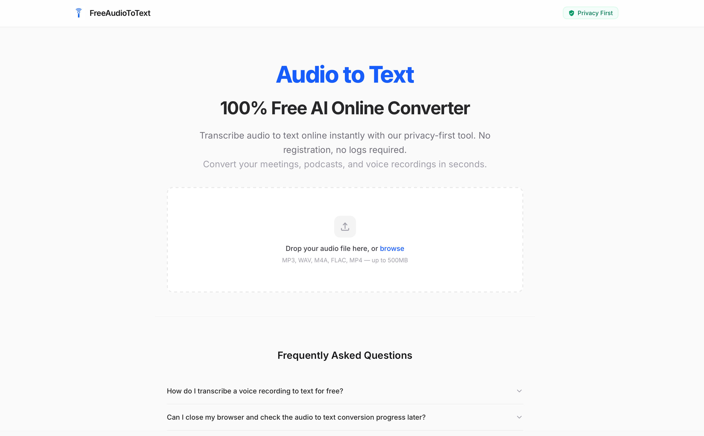

# FreeAudioToText

Welcome to the official issue tracker and public documentation repository for **[FreeAudioToText](https://freeaudiototext.com)**.

FreeAudioToText is a privacy-first, lightning-fast platform to **transcribe audio to text online free**. Our service requires no registration, guarantees 100% privacy with a strict 24-hour auto-deletion policy, and supports multiple languages with high-precision speaker diarization.

## 🔗 Official Website
**[https://freeaudiototext.com](https://freeaudiototext.com)**

---

## ⚠️ Repository Purpose

Please note that **this repository does not contain the core transcription engine source code**. Our proprietary AI transcription pipeline and multi-model routing logic remain closed-source to protect our intellectual property and prevent abuse. 

This repository serves as the official community hub to:
1. Track bug reports and technical issues.
2. Collect user feedback and feature requests.
3. Host public documentation and API examples.

## 🐛 Bug Reports & Feature Requests

If you encounter an issue while using our web application or have a suggestion to make FreeAudioToText better, we want to hear from you!

- **Report a Bug**: [Open a Bug Report](https://github.com/double2dev/audiototext/issues/new?assignees=&labels=bug&projects=&template=bug_report.yml)
- **Request a Feature**: [Open a Feature Request](https://github.com/double2dev/audiototext/issues/new?assignees=&labels=enhancement&projects=&template=feature_request.yml)

## 🔒 Privacy & Security

We take your data privacy extremely seriously. 
- All audio files are processed securely.
- Files and transcripts are **permanently and automatically deleted** from our servers within 24 hours.
- We do not use your private audio for AI training.

If you discover a security vulnerability, please refer to our [Security Policy](SECURITY.md) instead of opening a public issue.

## 🤝 Contributing

We welcome community feedback! Please review our [Contributing Guidelines](CONTRIBUTING.md) and [Code of Conduct](CODE_OF_CONDUCT.md) before participating in discussions or opening issues.

---
*Disclaimer: FreeAudioToText is a trademark of its respective owners. All rights reserved.*
